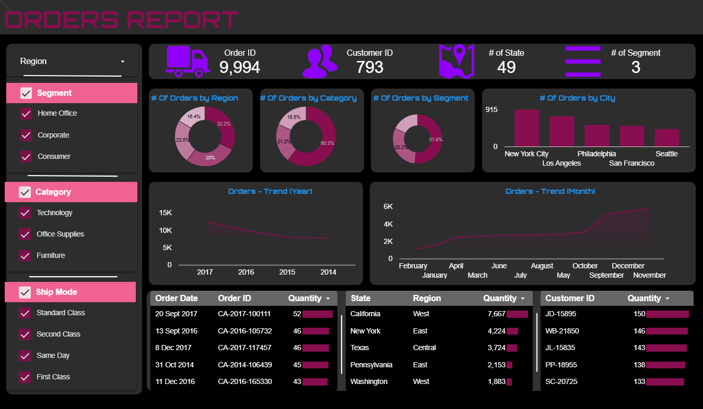
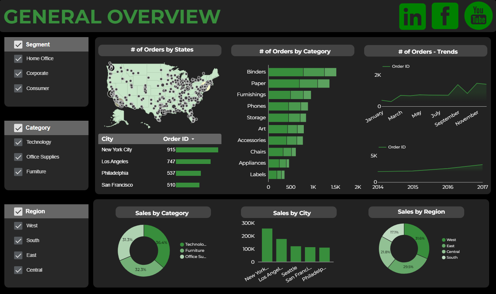

# Looker-Studio-Dashboards
A collection of interactive dashboards built using Google Looker Studio, featuring real-world data insights across marketing, web analytics, and business performance.

## Table of Contents
1. [Business Analysis Dashboard](#1-business-analysis-dashboard)
2. [Finance Analytics Dashboard](#2-finance-analytics-dashboard)
3. [Orders Dashboard](#3-orders-dashboard)
4. [Product Analysis Dashboard](#4-product-analysis-dashboard)
5. [Finance Analytics Dashboard](#5-finance-analytics-dashboard)
6. [Sales Dashboard](#6-sales-dashboard)

---

## 1. Business Analysis Dashboard

 [View Dashboard](https://lookerstudio.google.com/reporting/da339b1a-9454-41f6-b54d-711b2dc713e9)

**Description:**  
A two-part dashboard for both financial and geographical business performance:

* Part 1 – Financial KPIs:

- Key metrics: Profit, Sales, Average Profit Margin

- Time-series visualizations for Sales, Profit, and Cost of Sales by Month

* Part 2 – Geographical Insights:

- KPIs: Region, Country, City

- Monthly Sales/Profit analysis by Region

- Profit breakdown by City

Great for C-level overview combining sales trends and regional performance.

---

## 2. Finance Analytics Dashboard

 [View Dashboard](https://lookerstudio.google.com/reporting/508d6d6f-449e-4eae-a56b-fd908ce3fc36)

**Description:**  
A comprehensive finance dashboard focusing on profitability and cost structure:

* KPIs: Sales, Profit, Cost of Sales, Unit Cost, Price, Product Count

* Charts:

- Profit by Country, Product Category, Sub-Category, and Promotion

- Monthly analysis of Sales & Profit

- Quarterly analysis of Unit Cost and Cost of Sales

This dashboard empowers financial decision-making by visualizing cost and revenue trends.

---

## 3. Order Dashboard

 [View Dashboard](https://lookerstudio.google.com/reporting/d12b14e5-0e5c-4739-8ab7-180c6e7131b6)

**Description:**  
Designed to analyze customer order behavior, this dashboard includes:

- Filters: Region dropdown + lists for Segment, Category, and Ship Mode

- KPIs: Total Order ID, Customer ID, Number of States, Number of Segments

* Charts:

- Number of Orders by Region, Category, Segment, and City

- Order Trends by Year and Month

* Tables:

- Orders by Order Date, Order ID, and Quantity

- Orders by State, Region, and Quantity

- Orders by Customer ID and Quantity

Ideal for identifying trends in ordering patterns and customer behavior.

---

## 4. Product Analysis Dashboard

 [View Dashboard](https://lookerstudio.google.com/reporting/4b2a3c6b-ab98-4d32-8089-796347add353)

**Description:**  
This dashboard highlights product-level insights across pricing, category, and profitability:

* KPIs: # of Products, Average Price, # of Categories, # of Sub-Categories

* Charts:

- Profitability by Location and Sales Channel

- Category-wise breakdown of Sales, Profit, and Unit Cost

- Time-based analyses: Monthly Region, Category (Monthly & Quarterly)

* Filter: Dropdown for Product Category

This dashboard is tailored for product managers to evaluate performance, pricing, and regional demand.

---

## 5. Profit Analytics Dashboard

 [View Dashboard](https://lookerstudio.google.com/reporting/882a96e3-8721-4a22-b382-ff3cebd2c48f)

**Description:**  
A high-level profitability dashboard to track financial performance. Key components:

* KPIs: Sales, Profit, Cost of Sales, Unit Cost, Order Quantity, # of Orders, # of Cities, # of Countries

* Charts:

Profit Analysis by Product Category, Sub-Category

Monthly Product Analysis

Trend Analysis by Quarter and Year

Combined view of Profit, Sales, and Unit Cost across categories

* Dropdown Filter: Region

This dashboard provides in-depth profitability insights and cost dynamics across products and geographies.

---

## 6. Sales Dashboard

 [View Dashboard](https://lookerstudio.google.com/reporting/8766733c-b8b3-4d96-b063-8cf1ffde5507)

**Description:**  
This dashboard provides a comprehensive analysis of sales performance across different segments, categories, and regions. It includes insightful visualizations such as:

- Number of Orders by State and Category

- Trend analysis of total Orders over Time

- Sales breakdown by City, Region, and Category

This dashboard helps understand sales concentration and order behavior geographically and categorically.

---
